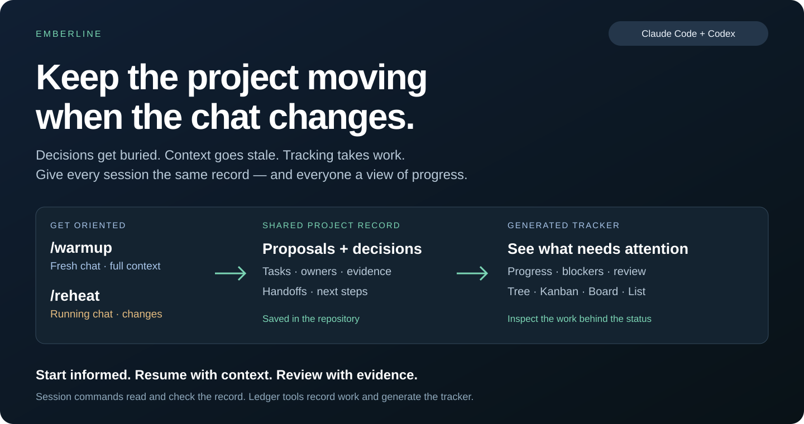
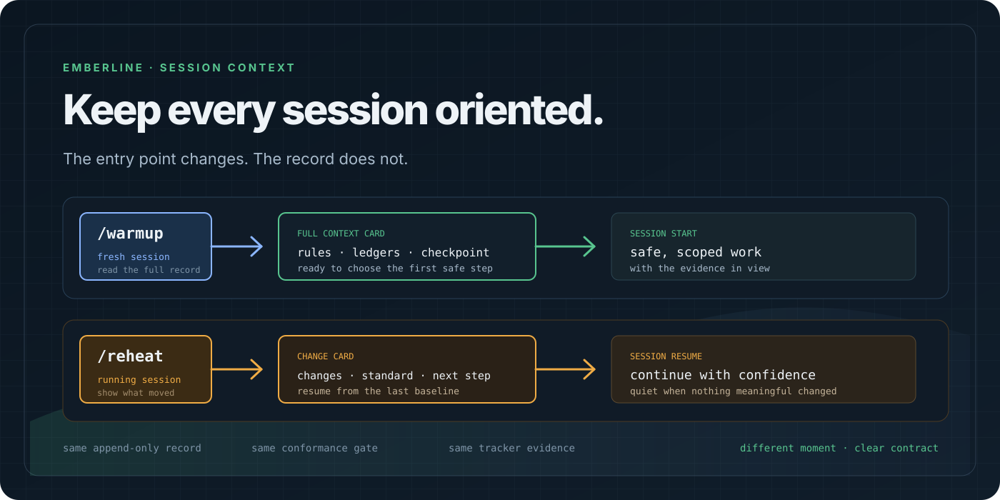
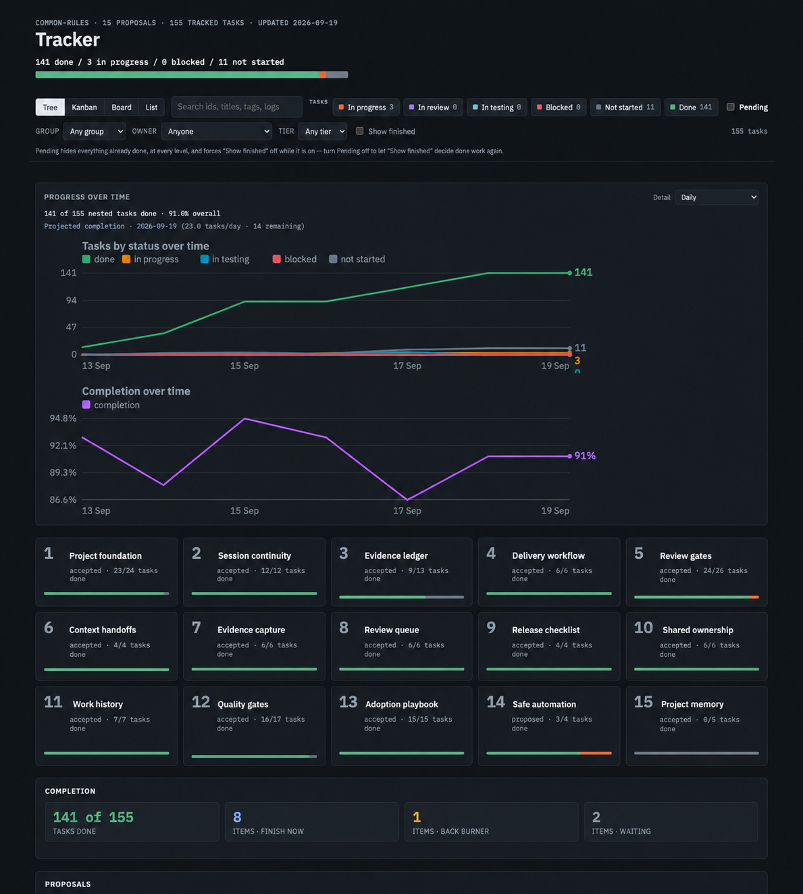

# Emberline — Shared Memory & Delivery Tracker for AI Agents

### Keep the project moving when the chat changes.

Emberline is an open-source **AI agent memory and project tracker** for
developer workflows. It keeps session context, proposals, decisions, and
next steps connected across **Claude Code and OpenAI Codex**.

[**Get started →**](docs/GETTING-STARTED.md) · [Explore the tracker](docs/proposals/tracker/index.html) · [Read the user guide](docs/user-guide/) · [Release 1.1.7](docs/RELEASE-1.1.7.md)

## Less catching up. More moving forward.

Decisions get buried in chats. Context goes stale. Emberline gives every
session a shared record — and you a clear view of what happens next.

## Pick up where the work left off.

**Warm-up** gives a fresh chat its starting context. **Reheat** brings a running
chat up to date. Your proposals, decisions, and next steps stay connected.

## See the whole project. Find the next step.

From proposal to progress, the tracker puts the work where you can inspect it.

## One record. Different ways to see it.

Explore proposals in **Tree**, follow work in **Kanban**, inspect cards in
**Board**, or scan the details in **List**.

_Edited tracker snapshot: the UI layout and data surface are preserved; proposal
labels are cleaned for the public story. The live tracker remains available above._

## Your agents share context. You keep the decisions.

A shared record supports the workflow; human review still decides what is accepted.

## How a project adopts this

Run `/standard` in the adopting project's chat to review the shared contract,
then use [`bin/derecord`](bin/derecord) to seed the project's handoff, tracker,
and hooks without overwriting its existing rules. Start the next session with
`/warmup` and use `/reheat` when a running session needs the latest delta.

[**Get started →**](docs/GETTING-STARTED.md) · [Capabilities & boundaries](docs/GETTING-STARTED.md#boundaries) · [User guide](docs/user-guide/) · [Release history](CHANGELOG.md)

## Attribution

Emberline is created and maintained by **Aashish Sud (codeDEXTER)**.

## Licensing

Code is available under [Apache-2.0](LICENSE). Documentation and visual
assets are available under [CC BY 4.0](LICENSE-DOCS). The Emberline name and
logo are project marks and are not licensed for implied endorsement.
